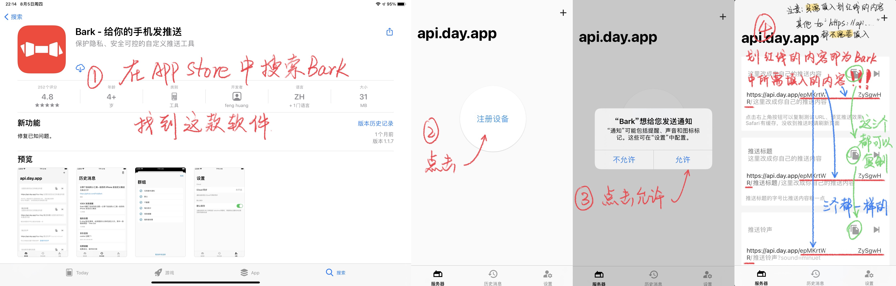

<h1 align="center">

GDUF_autocheck

</h1>

**广东金融学院易广金健康打卡**
- [x] 支持多人打卡👨‍👩‍👧‍👧
- [x] 支持Bark通知打卡结果💬
- [x] 默认地址是肇庆校区🏫
- [x] 基于Github Actions定时每日早上8:00自动打卡，完全解放你的设备和服务器✔

## 使用方法
- Star并Fork此项目。<br>
[Github fork 别人的项目源作者更新后如何同步更新](https://blog.csdn.net/zhongzunfa/article/details/80344585)
- 进入你的仓库，Settings → Secrets,
- 分别添加下列2个 Secrets（利用Secrets解决隐私问题）：
- Fork的项目是不会自动运行Action的，需要手动执行一次。
- 点击```Action``` -> ```I understand my workflows. go ahaed and enable them``` -> ```Enable workflow``` -> ```Run workflow``` -> ```Run workflow```

|Name |Value                                                        |
|:----|:------------------------------------------------------------|
|USERS|{"名字":["logintoken","地址"],"名字2":["logintoken2","地址2"]}|
|BARK |XXXXXXXXXXXXXXXXXXXXXX                                       |

备注：<br>
①理论上USERS项的Value格式填写正确，可添加无限用户<br>
②```地址```这一参数可以留空（留空则使用肇庆校区的默认地址），但要保留```""```<br>
③如何获取[logintoken](如何获取logintoken.pdf) <br>
④BARK的Value填入的是在你的Bark客户端里得到```https://api.day.app/XXXXXXXXXXXXXXXXXXXXXX```后面的那串字符<br>
⑤添加BARK这一步为可选步骤（非必要），不添加不会影响打卡，只是当打卡失败时不会向手机推送失败提醒<br>
⑥BARK获取教程：<br>


## 与我联系
- 有任何问题可以提交[issues](https://github.com/feizao67/GDUF_autocheck/issues/new)  
- QQ交流群：[550758147](https://qm.qq.com/cgi-bin/qm/qr?k=NM9kxBkkvWsNiKx-4y0IzzzpaaXbjGOx&jump_from=webapi)
- [电报群](https://t.me/gdspyp)


## 许可
本项目以 GPL-3.0 协议开源，详情请见 [LICENSE](LICENSE) 文件。
